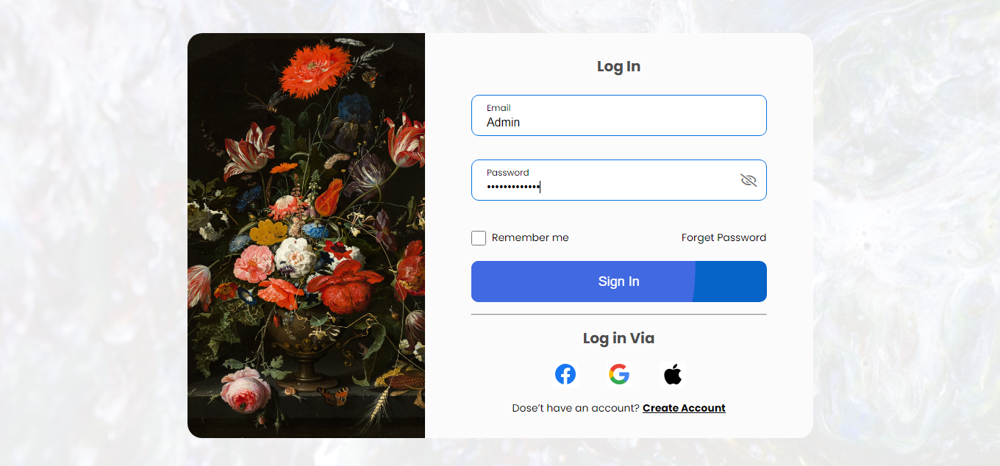

<h1 align="center">In the Name Of God</h1>

- **🌱 Advance Login & Register Form**

-  **🆓 Free to the public**
 
- - - - - - - - - - - - - - - - - - -  
🛠️  Attributes : 
 
<ul>
  <li>Clean coding and easy to understand for the audience</li>
  <li>Show the appropriate page in case of successful log-in</li>
  <li>Responsive</li>
  <li>Beautiful Design</li>
   
  <li><b>Limitations :</b></li>
  <li>It is impossible to create an account with a duplicate email</li>
  <li>When creating an account, the password must be the same</li>
  <li>Sensitive to invalid inputs</li>
</ul>
 
⚒   Language & Tool :
<ul>
  <li>Html</li>
  <li>Css</li>
  <li>Javascript</li>
</ul>
▪ ▪ ▪ ▪ ▪ ▪ ▪ ▪ ▪ ▪ ▪ ▪ ▪ ▪ ▪ ▪ ▪ ▪ ▪ ▪ ▪ ▪ ▪ ▪ ▪ ▪  ▪ ▪ ▪ ▪ ▪ ▪ ▪ ▪ ▪ ▪ ▪ ▪ ▪ ▪ ▪ ▪ ▪ ▪ ▪ ▪ ▪ ▪ ▪ ▪ ▪ ▪ ▪ ▪ ▪ ▪ ▪ ▪ ▪ 
🖼️ Picture :
 
 

 
- - - - - - - - - - - - - - - - - - - 
<h3 align="left">Connect with me:</h3>

    

 
- - - - - - - - - - - - -  - - - - - - 
 
 
Thank you for your beautiful look :) 🤍
  
- Designer : <a href="https://linkedin.com/in/gopal-krishan-sharma/"><i>Gopal Krishan Sharma</i></a>
 
- Developer : <a href="https://github.com/Hojjat-hk/"><i>Hojjat Hekmatipour</i></a>
